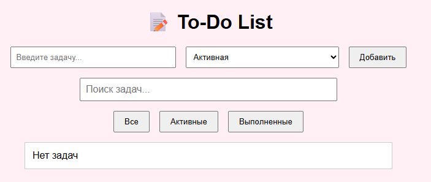
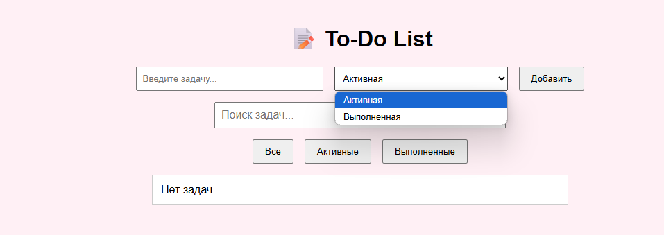
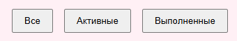

# Индивидуальный Проект `Cavarnali Anastasia IA2403`
# To-Do List: создание, редактирование и фильтрация задач по статусу. 

# Цель проекта
Разработать веб-приложения или функционального модуля с использованием чистого JavaScript(Vanilla JS).

 - **В данном проекте доступны следующие возможности:**

     - Добавление новых задач с удобным вводом

     - Отслеживание статуса задачи: активная или выполненная

     - Быстрый и удобный поиск по уже созданным задачам

     - Удаление ненужных или завершённых задач

     - Фильтрация (сортировка) задач по статусу — отображение только активных или только выполненных


 **<big>script.js</big>**<br>
Скрипт реализует функциональность интерактивного списка задач: добавление, редактирование, удаление, фильтрация по статусу, поиск по ключевым словам.

***Добавление задач***

После отправки формы задача добавляется в массив tasks. Если поле пустое — показывается сообщение об ошибке.
```js
taskForm.addEventListener('submit', (e) => {
  e.preventDefault();
  const text = taskInput.value.trim();
  const status = taskStatus.value;

  if (text === '') {
    errorMsg.textContent = 'Введите текст задачи!';
    return;
  }
  errorMsg.textContent = '';

  const task = {
    id: Date.now(),
    text,
    completed: status === 'completed'
  };
  tasks.push(task);
  taskInput.value = '';
  renderTasks();
});
```

***Удаление задач***

По клику на кнопку "Удалить" задача удаляется из массива tasks:

```js
taskList.addEventListener('click', (e) => {
  const id = Number(e.target.closest('li')?.dataset?.id);
  if (e.target.classList.contains('delete-btn')) {
    tasks = tasks.filter(task => task.id !== id);
  }
  renderTasks();
});
```

***Редактирование задачи (по двойному клику)***

Замена текста задачи через `<input>` — редактирование завершается по `blur` или Enter.

```js
taskList.addEventListener('dblclick', (e) => {
  if (!e.target.classList.contains('task-text')) return;
  const id = Number(e.target.closest('li').dataset.id);
  const span = e.target;

  const input = document.createElement('input');
  input.type = 'text';
  input.value = span.textContent;
  input.className = 'task-text editable';
  span.replaceWith(input);
  input.focus();

  input.addEventListener('blur', () => {
    const newText = input.value.trim();
    if (newText) {
      tasks = tasks.map(task =>
        task.id === id ? { ...task, text: newText } : task
      );
    }
    renderTasks();
  });

  input.addEventListener('keydown', (e) => {
    if (e.key === 'Enter') input.blur();
  });
});
```

***Смена статуса задачи (выполнена / активна)***

По клику на текст задачи её статус переключается:
```js
taskList.addEventListener('click', (e) => {
  if (e.target.classList.contains('task-text')) {
    const id = Number(e.target.closest('li').dataset.id);
    tasks = tasks.map(task =>
      task.id === id ? { ...task, completed: !task.completed } : task
    );
    renderTasks();
  }
});
```

***Фильтрация задач по структуре:***

Кнопки с data-filter переключают текущий фильтр:

```js
filterButtons.forEach(btn => {
  btn.addEventListener('click', () => {
    currentFilter = btn.dataset.filter;
    renderTasks();
  });
});
```
***Поиск по задачам***

Ввод текста в строку поиска фильтрует задачи по подстроке:

```js
searchInput.addEventListener('input', () => {
  currentSearch = searchInput.value.trim().toLowerCase();
  renderTasks();
});
```

***Отрисовка задач с учётом фильтра и поиска***

Главная функция renderTasks() отвечает за отображение задач по условиям фильтрации и поиска:

```js
function renderTasks() {
  taskList.innerHTML = '';
  const filtered = tasks.filter(task => {
    const matchesFilter = currentFilter === 'all' ||
      (currentFilter === 'active' && !task.completed) ||
      (currentFilter === 'completed' && task.completed);

    const matchesSearch = task.text.toLowerCase().includes(currentSearch);

    return matchesFilter && matchesSearch;
  });

  if (filtered.length === 0) {
    taskList.innerHTML = '<li>Нет задач</li>';
    return;
  }

  filtered.forEach(task => {
    const li = document.createElement('li');
    li.dataset.id = task.id;
    li.innerHTML = `
      <span class="task-text ${task.completed ? 'completed' : ''}">${task.text}</span>
      <button class="delete-btn">Удалить</button>
    `;
    taskList.appendChild(li);
  });
}
```

## Вызов и использование
 - Внешний вид пользовательского интерфейса и удобное расположение иконок для заполнения:

    

 - Определение состояния задачи
  

 - Фильтрация (сортировка) задач по статусу

    


## Технические детали

1. **HTML и CSS**

    - Используется статическая HTML-структура.

    - Весь внешний вид настраивается через кастомный CSS:

    - Нежный розовый фон страницы (#fff0f5),

    - Удобный и понятный интерфейс с использованием Flexbox,

    - Скругления, тени и отступы для визуального комфорта,

    - Централизованный ввод и фильтрация,

    - Кнопки и текст черного цвета для лучшей читаемости,

    - Удобная верстка под задачи, фильтры и поиск.

2. **JavaScript (Vanilla JS, ES6)**

   - Вся логика сосредоточена в одном модуле: script.js.

   - Используются современные возможности ES6+:

     - let, const, стрелочные функции,

     - Методы массива: map, filter, forEach, includes,

     - Шаблонные строки, деструктуризация, dataset, classList.

3. **Работа с DOM**

   - Создание элементов через createElement, добавление через appendChild.

   - Ввод задач, редактирование, удаление и фильтрация происходят без перезагрузки страницы.

   - Реализована двойная функциональность по клику на текст задачи:

      - Одинарный клик — отметить как выполненную,

      - Двойной клик — редактирование текста через input.

5. **Основная логика**

   ✅ Добавление задач (с валидацией).

   ✅ Удаление задач.

   ✅ Редактирование задачи двойным кликом.

   ✅ Отметка задачи как выполненной.

   ✅ Фильтрация задач по статусу: все, активные, выполненные.

   ✅ Поиск задач по названию (ввод в строку поиска).

   ✅ Подсветка активной кнопки фильтра.

6. **События**

    - `submit` — добавление задачи;
    - `click` — удалить или переключить статус;
    - `dblclick` — редактирование задачи;
    - `input` — поиск;
    - `change` — фильтрация по статусу.

7. **Валидация**

   - Проверка на пустую строку перед добавлением новой задачи.
   - При ошибке отображается сообщение в блоке .error.


## Источники

- [MoodleUSM](https://moodle.usm.md/course/view.php?id=6455)
- [JavaScript.ru](https://learn.javascript.ru)
- [GitHub](https://github.com/MSU-Courses/javascript/blob/main/lab/lab_guidelines.md)
- [ChatGPT](https://chatgpt.com/)
- [DeepSeek](https://chat.deepseek.com/)
- Условия индивидуального проекта (Moodle + GitHub)

