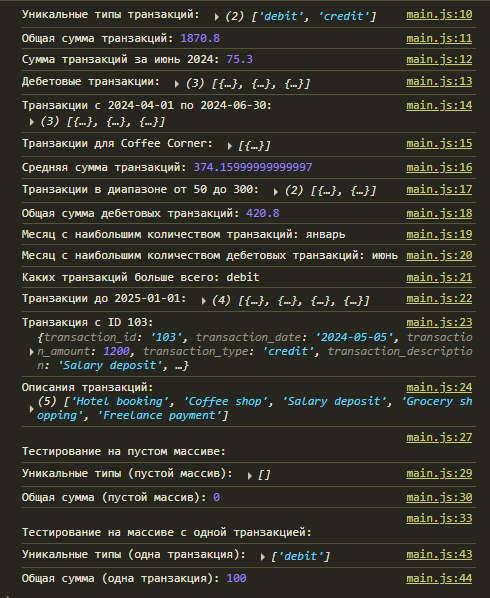

# Лабораторная работа №2 `Cavarnali Anastasia IA2403`
## Запуск проекта:
- Открытие файла `index.html`
- Открытия консоли браузера, через  `F12` 

## Цель работы:
Изучить основы работы с массивами и функциями в JavaScript, применяя их для обработки и анализа транзакций.

## Шаг 1. Создание массива транзакций

  - Создал файл main.js для размещения вашего кода.
  - Взял массив объектов с транзакциями. Каждая транзакция содержит следующие свойства:

    - transaction_id - уникальный идентификатор транзакции.
    - transaction_date - дата транзакции.
    - transaction_amount - сумма транзакции.
    - transaction_type - тип транзакции (приход или расход).
    - transaction_description - описание транзакции.
    - merchant_name - название магазина или сервиса.
    - card_type - тип карты (кредитная или дебетовая).

    ## Шаг 2. Реализация функций для анализа транзакций


### 1. `getUniqueTransactionTypes(transactions)`
- Возвращает массив уникальных типов транзакций.
- Используйте Set() для выполнения задания.

```js
     /**
 * Возвращает массив уникальных типов транзакций.
 * @param {Array<Object>} transactions - Массив транзакций.
 * @returns {Array<string>} Массив уникальных типов транзакций.
 */
const getUniqueTransactionTypes = (transactions) => {
    return [...new Set(transactions.map(t => t.transaction_type))];
};
```
### 2. `calculateTotalAmount(transactions)` 
 - Вычисляет сумму всех транзакций.
```JS
 /**
 * Вычисляет сумму всех транзакций.
 * @param {Array<Object>} transactions - Массив транзакций.
 * @returns {number} Сумма всех транзакций.
 */
const calculateTotalAmount = (transactions) => {
    return transactions.reduce((sum, t) => sum + t.transaction_amount, 0);
};
```
 
### 3. calculateTotalAmountByDate(transactions, year, month, day) [extra]

- Вычисляет общую сумму транзакций за указанный год, месяц и день.
- Параметры year, month и day являются необязательными.
- В случае отсутствия одного из параметров, метод производит расчет по остальным.

```js
/**
 * Вычисляет общую сумму транзакций за указанный год, месяц и день.
 * @param {Array<Object>} transactions - Массив транзакций.
 * @param {number} [year] - Год (необязательный параметр).
 * @param {number} [month] - Месяц (1-12, необязательный параметр).
 * @param {number} [day] - День (необязательный параметр).
 * @returns {number} Сумма транзакций за указанный период.
 */
const calculateTotalAmountByDate = (transactions, year, month, day) => {
    return transactions
        .filter(t => {
            const date = new Date(t.transaction_date);
            return (!year || date.getFullYear() === year) &&
                   (!month || date.getMonth() + 1 === month) &&
                   (!day || date.getDate() === day);
        })
        .reduce((sum, t) => sum + t.transaction_amount, 0);
};
```

### 4. `getTransactionByType(transactions, type)` 
- Возвращает транзакции указанного типа (debit или credit)

```JS
/**
 * Возвращает транзакции указанного типа (debit или credit).
 * @param {Array<Object>} transactions - Массив транзакций.
 * @param {string} type - Тип транзакции ('debit' или 'credit').
 * @returns {Array<Object>} Массив транзакций указанного типа.
 */
const getTransactionByType = (transactions, type) => {
    return transactions.filter(t => t.transaction_type === type);
};
```
### 5. `getTransactionsInDateRange(transactions, startDate, endDate)` 
- Возвращает массив транзакций, проведенных в указанном диапазоне дат от startDate до endDate.

```JS
/**
 * Возвращает массив транзакций в указанном диапазоне дат.
 * @param {Array<Object>} transactions - Массив транзакций.
 * @param {string} startDate - Начальная дата (в формате YYYY-MM-DD).
 * @param {string} endDate - Конечная дата (в формате YYYY-MM-DD).
 * @returns {Array<Object>} Массив транзакций в диапазоне дат.
 */
const getTransactionsInDateRange = (transactions, startDate, endDate) => {
    const start = new Date(startDate);
    const end = new Date(endDate);
    
    return transactions.filter(t => {
        const transactionDate = new Date(t.transaction_date);
        return transactionDate >= start && transactionDate <= end;
    });
};
```
### 6. `getTransactionsByMerchant(transactions, merchantName)` 
- Возвращает массив транзакций, совершенных с указанным merchantName.

```js
/**
 * Возвращает массив транзакций, совершенных у указанного продавца.
 * @param {Array<Object>} transactions - Массив транзакций.
 * @param {string} merchantName - Название продавца/мерчанта.
 * @returns {Array<Object>} Массив транзакций указанного продавца.
 */
const getTransactionsByMerchant = (transactions, merchantName) => {
    return transactions.filter(t => 
        t.merchant_name.toLowerCase() === merchantName.toLowerCase()
    );
};
```
### 7. `calculateAverageTransactionAmount(transactions)` 
- Возвращает среднее значение транзакций.
```js
/**
 * Вычисляет среднее арифметическое значение суммы транзакций.
 * @param {Array<Object>} transactions - Массив транзакций.
 * @returns {number} Среднее значение суммы транзакций (0 для пустого массива).
 */
const calculateAverageTransactionAmount = (transactions) => {
    if (transactions.length === 0) return 0;
    
    const total = transactions.reduce((sum, t) => sum + t.transaction_amount, 0);
    return total / transactions.length;
};
```
### 8. `getTransactionsByAmountRange(transactions, minAmount, maxAmount)` 
- Возвращает массив транзакций с суммой в заданном диапазоне от minAmount до maxAmount.

```js
/**
 * Возвращает транзакции с суммой в указанном диапазоне (включительно).
 * @param {Array<Object>} transactions - Массив транзакций.
 * @param {number} minAmount - Минимальная сумма диапазона.
 * @param {number} maxAmount - Максимальная сумма диапазона.
 * @returns {Array<Object>} Отфильтрованный массив транзакций.
 * @throws {Error} Если minAmount > maxAmount.
 */
const getTransactionsByAmountRange = (transactions, minAmount, maxAmount) => {
    // Валидация входных параметров
    if (minAmount > maxAmount) {
        throw new Error('Минимальная сумма не может превышать максимальную');
    }

    return transactions.filter(transaction => {
        const amount = transaction.transaction_amount;
        return amount >= minAmount && amount <= maxAmount;
    });
};
```

### 9. `calculateTotalDebitAmount(transactions)` 
- Вычисляет общую сумму дебетовых транзакций.

```js
/**
 * Вычисляет общую сумму дебетовых транзакций (transaction_type === "debit").
 * @param {Array<Object>} transactions - Массив транзакций.
 * @returns {number} Сумма всех дебетовых транзакций (0 если нет дебетовых операций).
 */
const calculateTotalDebitAmount = (transactions) => {
    return transactions
        .filter(t => t.transaction_type === "debit")
        .reduce((total, t) => total + t.transaction_amount, 0);
};
```

### 10. `findMostTransactionsMonth(transactions)` 
- Возвращает месяц, в котором было больше всего транзакций.

```js
/**
 * Определяет месяц с наибольшим количеством транзакций.
 * @param {Array<Object>} transactions - Массив транзакций.
 * @returns {string|null} Название месяца или null для пустого массива.
 */
const findMostTransactionsMonth = (transactions) => {
    if (transactions.length === 0) return null;
    
    // 1. Создаем объект для подсчета транзакций по месяцам
    const monthCounts = transactions.reduce((counts, transaction) => {
        const date = new Date(transaction.transaction_date);
        const monthName = date.toLocaleString('default', { month: 'long' });
        
        counts[monthName] = (counts[monthName] || 0) + 1;
        return counts;
    }, {});
    
    // 2. Находим месяц с максимальным количеством транзакций
    const [mostActiveMonth] = Object.entries(monthCounts).reduce(
        ([maxMonth, maxCount], [month, count]) => 
            count > maxCount ? [month, count] : [maxMonth, maxCount],
        ['', 0]
    );
    
    return mostActiveMonth;
};
```

### 11. `findMostDebitTransactionMonth(transactions)` 
- Возвращает месяц, в котором было больше дебетовых транзакций.

```js
/**
 * Определяет месяц с максимальным количеством дебетовых транзакций.
 * @param {Array<Object>} transactions - Массив транзакций.
 * @returns {string|null} Название месяца или null, если дебетовых транзакций нет.
 */
const findMostDebitTransactionMonth = (transactions) => {
    // 1. Фильтрация дебетовых транзакций
    const debits = transactions.filter(t => t.transaction_type === "debit");
    
    if (debits.length === 0) return null;
    
    // 2. Подсчет транзакций по месяцам
    const monthStats = debits.reduce((stats, t) => {
        const month = new Date(t.transaction_date).toLocaleString('ru-RU', { month: 'long' });
        stats[month] = (stats[month] || 0) + 1;
        return stats;
    }, {});
    
    // 3. Поиск месяца с максимумом транзакций
    return Object.entries(monthStats).reduce(
        (max, [month, count]) => count > max.count ? { month, count } : max,
        { month: null, count: -1 }
    ).month;
};
```

### 12. `mostTransactionTypes(transactions)` 
- Возвращает каких транзакций больше всего.
- Возвращает debit, если дебетовых.
- Возвращает credit, если кредитовых.
- Возвращает equal, если количество равно.

```js
/**
 * Определяет, каких транзакций больше: дебетовых или кредитовых.
 * @param {Array<Object>} transactions - Массив транзакций.
 * @returns {'debit'|'credit'|'equal'} Результат сравнения.
 */
const mostTransactionTypes = (transactions) => {
    // Подсчет количества транзакций каждого типа
    let debitCount = 0;
    let creditCount = 0;
    
    for (const t of transactions) {
        if (t.transaction_type === 'debit') {
            debitCount++;
        } else if (t.transaction_type === 'credit') {
            creditCount++;
        }
    }
    
    // Определение результата
    if (debitCount > creditCount) return 'debit';
    if (creditCount > debitCount) return 'credit';
    return 'equal';
};
```

### 13. `getTransactionsBeforeDate(transactions, date)` 
- Возвращает массив транзакций, совершенных до указанной даты.

```js
/**
 * Возвращает транзакции, совершенные до указанной даты (исключая эту дату).
 * @param {Array<Object>} transactions - Массив транзакций.
 * @param {string} date - Граничная дата в формате YYYY-MM-DD.
 * @returns {Array<Object>} Массив транзакций до указанной даты.
 */
const getTransactionsBeforeDate = (transactions, date) => {
    const boundaryDate = new Date(date);
    
    return transactions.filter(transaction => {
        const transactionDate = new Date(transaction.transaction_date);
        return transactionDate < boundaryDate;
    });
};
```

### 14. `findTransactionById(transactions, id)` 
- Возвращает транзакцию по ее уникальному идентификатору (id).

```js
/**
 * Находит транзакцию по ID.
 * @param {Array<Object>} transactions - Массив транзакций.
 * @param {string} id - Идентификатор транзакции.
 * @returns {Object|null} Найденная транзакция или null.
 */
const findTransactionById = (transactions, id) => {
    // Проверка на пустой массив
    if (!transactions || transactions.length === 0) return null;
    
    // Поиск транзакции (возвращает null если не найдено)
    return transactions.find(transaction => 
        transaction.transaction_id === id
    ) || null;
};
```

### 15. `mapTransactionDescriptions(transactions)` 
- Возвращает новый массив, содержащий только описания транзакций.

```js
/**
 * Извлекает описания всех транзакций.
 * @param {Array<Object>} transactions - Массив транзакций.
 * @returns {Array<string>} Массив описаний.
 */
const mapTransactionDescriptions = (transactions) => {
    // Проверка на пустой ввод
    if (!transactions || transactions.length === 0) return [];
    
    // Извлечение описаний
    return transactions.map(transaction => 
        transaction.transaction_description
    );
};
```

## Шаг 3. Тестирование функций

1. Создать массив транзакций и протестируйте все функции.
2. Вывести результаты в консоль.
3. Проверить работу функций на различных наборах данных.
4. Проверить работу функций на пустом массиве транзакций [extra].
5. Проверить работу функций на массиве транзакций с одной транзакцией [extra].



## Контрольные вопросы
  1. Какие методы массивов можно использовать для обработки объектов в JavaScript?
  
**Ответ:** Для работы с массивами объектов подходят методы `map()`, `filter()` и `reduce()`. С их помощью можно:

+ `map()` – преобразовать каждый элемент массива (например, извлечь определённые свойства объектов).
+ `filter()` – отфильтровать элементы по заданному условию.
+ `reduce()` – вычислить общее значение на основе всех элементов (например, сумму или агрегированные данные).

2. Как сравнивать даты в строковом формате в JavaScript?
 
 **Ответ:** 
- Если даты записаны в формате `YYYY-MM-DD`, их можно сравнивать как обычные строки через операторы `>`, `<` и `===` (лексикографический порядок совпадает с хронологическим).
- Если формат другой (например, `DD.MM.YYYY`), нужно:
    + Разобрать строку вручную или преобразовать в объект `Date` (например, через `new Date()`).

    + Сравнить числовые значения дат (через `date1.getTime() > date2.getTime()`).

3. В чем разница между `map()`, `filter()` и `reduce()` при работе с массивами объектов?
 
 **Ответ:** 
+ `map()` – создаёт новый массив, применяя функцию к каждому элементу (например, извлекая значения свойств).
+ `filter()` – возвращает массив только с теми элементами, которые соответствуют условию.
+ `reduce()` – объединяет все элементы в одно значение (например, сумму, строку или объект).

## Использованные источники
- [MoodleUSM](https://moodle.usm.md/course/view.php?id=6455)
- [JavaScript.ru](https://learn.javascript.ru)
- [GitHub](https://gist.github.com/asabaylus/3071099#start-of-content)
- [ChatGPT](https://chatgpt.com/)
- [DeepSeek](https://chat.deepseek.com/)