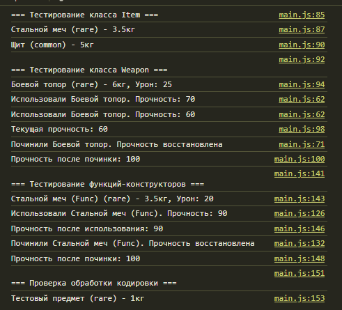

# Лабораторная работа №3 `Cavarnali Anastasia IA2403`
## Запуск проекта:
- Открытие файла `index.html`
- Открытие консоли браузера, чреез `F12` или `контекстное меню->код элемента`

# Цель работы
Познакомиться с классами и объектами в JavaScript, научиться создавать классы, использовать конструкторы и методы, а также реализовать наследование.

# Условие
Создать  консольное приложение, моделирующее систему инвентаря, где можно добавлять предметы, изменять их свойства и управлять ими.

## Шаг 1. Создание класса `Item`
Создать класс Item, который будет представлять предмет в инвентаре.

### Поля класса:
- `name` – название предмета.
- `weight` – вес предмета.
- `rarity` – редкость предмета (common, uncommon, rare, legendary).
### Методы:
- `getInfo()` – возвращает строку с информацией о предмете.
- `setWeight(newWeight)` – изменяет вес предмета.

```js
// Шаг 1. Создание класса Item

/**
 * Класс, представляющий предмет в инвентаре.
 */
class Item {
    /**
     * @param {string} name - Название предмета.
     * @param {number} weight - Вес предмета.
     * @param {'common' | 'uncommon' | 'rare' | 'legendary'} rarity - Редкость предмета.
     */
    constructor(name, weight, rarity) {
      this.name = name;
      this.weight = weight;
      this.rarity = rarity;
    }
  
    /**
     * Возвращает информацию о предмете.
     * @returns {string}
     */
    getInfo() {
      // Исправляем кодировку при выводе
      const fixedRarity = this.rarity === 'гаге' ? 'rare' : this.rarity;
      return `${this.name} (${fixedRarity}) - ${this.weight}кг`;
    }
  
    /**
     * Обновляет вес предмета.
     * @param {number} newWeight
     */
    setWeight(newWeight) {
      this.weight = newWeight;
    }
}

```

## Шаг 2. Создание класса `Weapon`
Создать класс Weapon, который расширяет Item.

### Дополнительные поля:
- `damage` – урон оружия.
- `durability` – прочность (от 0 до 100).
Методы:
- `use()` – уменьшает durability на 10 (если `durability` > 0).
- `repair()` – восстанавливает durability до 100.

```js
// Шаг 2. Создание класса Weapon

/**
 * Класс, представляющий оружие. Наследуется от Item.
 */
class Weapon extends Item {
    /**
     * @param {string} name - Название оружия.
     * @param {number} weight - Вес оружия.
     * @param {'common' | 'uncommon' | 'rare' | 'legendary'} rarity - Редкость.
     * @param {number} damage - Урон.
     * @param {number} durability - Прочность.
     */
    constructor(name, weight, rarity, damage, durability) {
      super(name, weight, rarity);
      this.damage = damage;
      this.durability = durability;
    }
  
    /**
     * Использует оружие (уменьшает прочность).
     */
    use() {
      if (this.durability > 0) {
        this.durability = Math.max(0, this.durability - 10);
        console.log(`Использовали ${this.name}. Прочность: ${this.durability}`);
      }
    }
  
    /**
     * Восстанавливает прочность до 100.
     */
    repair() {
      this.durability = 100;
      console.log(`Починили ${this.name}. Прочность восстановлена`);
    }
  
    /**
     * Возвращает информацию об оружии.
     * @returns {string}
     */
    getInfo() {
      const fixedRarity = this.rarity === 'гаге' ? 'rare' : this.rarity;
      return `${this.name} (${fixedRarity}) - ${this.weight}кг, Урон: ${this.damage}`;
    }
}

```
## Шаг 3. Тестирование
1. Создайть несколько объектов классов Item и Weapon.
2. Вызвать их методы, чтобы убедиться в правильности работы.

```js
// Шаг 3. Тестирование классов

// Создание объектов классов Item и Weapon

console.log("=== Тестирование класса Item ===");
const sword = new Item("Стальной меч", 3.5, "rare");
console.log(sword.getInfo());  // Стальной меч (rare) - 3.5кг

const shield = new Item("Щит", 5.0, "common");
console.log(shield.getInfo()); // Щит (common) - 5кг

console.log("\n=== Тестирование класса Weapon ===");
const axe = new Weapon("Боевой топор", 6.0, "rare", 25, 80);
console.log(axe.getInfo());    // Боевой топор (rare) - 6кг, Урон: 25

// Использование оружия
axe.use(); // Боевой топор (rare) - 6кг, Урон: 25
axe.use(); // Боевой топор (rare) - 6кг, Урон: 25
console.log(`Текущая прочность: ${axe.durability}`); // 60

// Починка оружия
axe.repair(); 
console.log(`Прочность после починки: ${axe.durability}`); // 100

```

## Шаг 4. Дополнительное задание
1. Опциональная цепочка (?.) – использовать ее при доступе к свойствам объекта, чтобы избежать ошибок.
2. Создание функции-конструктора:
    - Переписать классы Item и Weapon, используя функции-конструкторы вместо class.

```js
const item = new Item("Меч", 3.0, "common");

// Допустим, свойство damage может быть не у каждого предмета
console.log(item?.damage); // undefined, если damage не существует
// Функция-конструктор для класса Item
function Item(name, weight, rarity) {
    this.name = name;
    this.weight = weight;
    this.rarity = rarity;
}

Item.prototype.getInfo = function() {
    const fixedRarity = this.rarity === 'гаге' ? 'rare' : this.rarity;
    return `${this.name} (${fixedRarity}) - ${this.weight}кг`;
};

Item.prototype.setWeight = function(newWeight) {
    this.weight = newWeight;
};

// Функция-конструктор для класса Weapon (наследует от Item)
function Weapon(name, weight, rarity, damage, durability) {
    // Вызов конструктора родителя (Item)
    Item.call(this, name, weight, rarity);
    this.damage = damage;
    this.durability = durability;
}

// Наследование от Item
Weapon.prototype = Object.create(Item.prototype);
Weapon.prototype.constructor = Weapon;

Weapon.prototype.use = function() {
    if (this.durability > 0) {
        this.durability = Math.max(0, this.durability - 10);
        console.log(`Использовали ${this.name}. Прочность: ${this.durability}`);
    }
};

Weapon.prototype.repair = function() {
    this.durability = 100;
    console.log(`Починили ${this.name}. Прочность восстановлена`);
};

Weapon.prototype.getInfo = function() {
    const fixedRarity = this.rarity === 'гаге' ? 'rare' : this.rarity;
    return `${this.name} (${fixedRarity}) - ${this.weight}кг, Урон: ${this.damage}`;
};

// Тестирование
console.log("=== Тестирование функций-конструкторов ===");

const swordFunc = new Weapon("Стальной меч (Func)", 3.5, "rare", 20, 100);
console.log(swordFunc.getInfo()); // Стальной меч (Func) (rare) - 3.5кг, Урон: 20

swordFunc.use();
console.log(`Прочность после использования: ${swordFunc.durability}`); // Прочность после использования: 90
swordFunc.repair();
console.log(`Прочность после починки: ${swordFunc.durability}`); // Прочность после починки: 100
```



## Контрольные вопросы
1. Какое значение имеет `this` в методах класса?

    **Ответ:** В методах класса `this` ссылается на текущий экземпляр объекта, к которому принадлежит метод. Это позволяет обращаться к свойствам и методам объекта внутри самого класса.

2. Как работает модификатор доступа # в JavaScript?

    **Ответ:** `Модификатор #` делает свойства и методы класса приватными. Они доступны только внутри класса, и не могут быть напрямую доступны извне.

3. В чем разница между классами и функциями-конструкторами?

    **Ответ:**
    - `Классы` — это синтаксический сахар, введенный в ES6, который является более удобным способом создания объектов и работы с наследованием.

    - `Функции-конструкторы` — это более старый способ создания объектов, до появления классов в ES6. Они используются с помощью ключевого слова new, чтобы создавать экземпляры объектов.

## Использованные источники
- [MoodleUSM](https://moodle.usm.md/course/view.php?id=6455)
- [JavaScript.ru](https://learn.javascript.ru)
- [GitHub](https://github.com/MSU-Courses/javascript/blob/main/lab/lab_guidelines.md)
- [ChatGPT](https://chatgpt.com/)
- [DeepSeek](https://chat.deepseek.com/)