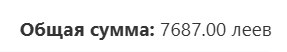

# Лабораторная работа №4. Работа с DOM-деревом и событиями в JavaScript `Cavarnali Anastasia IA2403`

## Цель работы
Ознакомиться с основами взаимодействия JS с DOM-деревом на основе веб-приложения для учета личных финансов.

## Запуск проекта
 - Запустить проект в VS Code, предварительно установив расширение `Live Server`.

 - Активировать сервер, кликнув на кнопку `Go Live` в нижнем правом углу окна или выбрав в контекстном меню HTML-файла опцию «Открыть с помощью Live Server». 

## Список функции
Проект включает 4 основных JavaScript-файла с функционалом:
 - `index.js` -  главный файл, который будет импортировать другие модули.
 - `ui.js` -  модуль для работы с DOM (отрисовка таблицы, формы и т. д.).
 - `transactions.js` - модуль для работы с массивом транзакций.
 - `utils.js` - вспомогательные функции (например, генерация ID, форматирование даты).


**<big>index.js</big>**<br>

Связывает форму с обработчиком событий:
```js
import {GetDataForm} from './ui.js';
import {form} from './ui.js';
form.addEventListener('submit', GetDataForm);
```

**<big>ui.js</big>**<br>
1. Получение и валидация данных формы:

```js
export function GetDataForm(event){
    event.preventDefault();
    const formData = new FormData(form);
    if(0 > Number(formData.get("sum")) || Number(formData.get("sum")) > 10000000 ){
        const errMsg = document.createElement("div");
        errMsg.innerHTML = "<p style =\"background-color: brown; color: white;\">incorrect amount: must be positive and less than 10,000,000</p>";
        form.appendChild(errMsg);
        setTimeout(()=>errMsg.remove(), 5000);
    }
    else{
        addTransaction(formData);
    }
}
```

2. Добавление транзакции:
```js
export function addTransaction(data) {
    const now = new Date();
    const formattedDate = now.toLocaleString('ru-RU');
    const newId = generateId(formattedDate); 
    const transaction = {
        id: newId,
        date: formattedDate,
        amount: Number(data.get("sum")),
        type: data.get("type"),
        info: data.get("info")
    };
    transactions.push(transaction);
    renderTransaction(transaction);
    document.getElementById("add").reset();
    updateTotalSum();
}
```
3. Отображение транзакции:
```js
function renderTransaction(tx) {
    const newRow = document.createElement("tr");
    newRow.dataset.id = tx.id;
    // ... создание ячеек и кнопки удаления ...
    if(tx.type === "debit")
        newRow.id="debit-g";
    else if(tx.type === "credit")
        newRow.id="credit-r";
    table.appendChild(newRow);
}
```

4. Обновление общей суммы:
```js
function updateTotalSum(){
    let total_amount = 0;
    for (const tx of transactions) {
        if (tx.type === "debit") total_amount += Number(tx.amount);
        else if (tx.type === "credit") total_amount -= Number(tx.amount);
    }
    document.getElementById("total_sum").lastElementChild.innerText = 
        total_amount.toLocaleString("ru-RU", { minimumFractionDigits: 2 });
}
```

5. Анализ преобладающего типа операций:
```js
function buttonMostTransactionTypes(){
    if(transactions.length == 0){
        alert("transactions is empty");
        return;
    }
    const trns = mostTransactionTypes(transactions);
    alert(trns);
}
document.getElementById("most_trns_type").addEventListener('click', buttonMostTransactionTypes);
```

6.Подсчет суммы доходов:
```js
function buttonTotalDebitAmount(){
    if(transactions.length == 0){
        alert("transactions is empty");
        return;
    }
    const trns = calculateTotalDebitAmount(transactions);
    alert("Total debit amount:"+trns);
}
document.getElementById("total_debi_amount").addEventListener('click', buttonTotalDebitAmount);
```
**<big>transactions.js</big>**<br>

Хранилище данных:
```js
export const transactions = [];
```

**<big>utils.js</big>**<br>

Генерация ID:
```js
export function generateId(time) {
    time = time.replace(/[.,: ]/g, '');
    const rand = Math.floor(Math.random() * 1e5);
    return `${time}${rand}`;
}
```


## Вызов и использование

Для начала нужно ввести правильные данные в форму:


Пополняем журнал транзакций новыми записями


Выводится общая сумма транзакций




## Контрольные вопросы

1. Каким образом можно получить доступ к элементу на веб-странице с помощью JavaScript?

    **Ответ:**
    - Доступ к элементу на веб-странице в JavaScript можно получить с помощью специальных методов. Чаще всего используют `document.getElementById`, если у элемента есть `id`, или `document.querySelector`, чтобы найти элемент по любому CSS-селектору. Например, `document.getElementById('menu')` вернёт элемент с id "menu", а `document.querySelector('.button')` найдёт первый элемент с классом "button". Также можно использовать `getElementsByClassName`, `getElementsByTagName` или `querySelectorAll` для получения списка элементов.


2. Что такое делегирование событий и как оно используется для эффективного управления событиями на элементах DOM?

    **Ответ:**
    - `Делегирование событий (event delegation)` — это техника, при которой обработчик события устанавливается не на каждый элемент отдельно, а на их общего родителя. Затем, при возникновении события, мы определяем, на каком дочернем элементе оно произошло, и обрабатываем его при необходимости.


3. Как можно изменить содержимое элемента DOM с помощью JavaScript после его выборки?

    **Ответ:**
     - Чтобы изменить содержимое элемента в JavaScript, сначала нужно выбрать элемент, а затем изменить его свойство:
        - `textContent` — для обычного текста:

          `element.textContent = 'Новый текст';`

        - `innerHTML` — если нужен HTML-код внутри:

          `element.innerHTML = '<b>Жирный текст</b>';`

        - `innerText` — как `textContent`, но учитывает стили:

          `element.innerText = 'Текст';`

4. Как можно добавить новый элемент в DOM-дерево с помощью JavaScript?
    **Ответ:**
    - Чтобы добавить новый элемент в DOM-дерево с помощью JavaScript, сначала создают элемент с помощью команды `document.createElement`, затем наполняют его содержимым, например добавляют текст или классы, и после этого вставляют его в нужное место на странице через методы, такие как `appendChild` или `append`. Например, можно создать новый блок `<div>`, задать ему текст, а затем добавить его внутрь существующего контейнера на странице.
